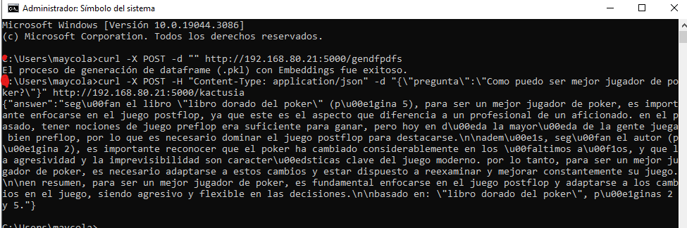
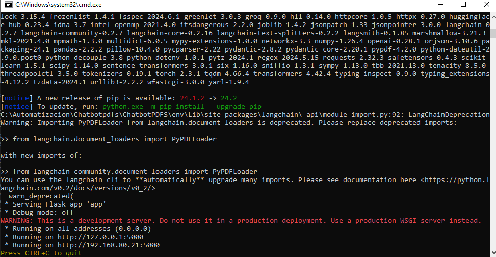

# Mi Proyecto
Autor: Maycol Steven Avendaño Niño
## Descripción
Este proyecto es una API Rest de una aplicacion de NPL. Especificamente tiene como funcionamiento
ser un chatbot de pdfs. Los pdfs se alojan en el directorio documents y la api recibe peticiones POST.

## Instalación
1. Clona el repositorio
2. Ejecutar el .bat dando dobleclick y copiar la url proporcionada por Flask en el cmd abierto
3. Pega los .pdfs en la carpeta 'documents'

## Uso
1. Crear la BD Vectorial ejecutando en otro cmd el comando: 
curl -X POST -d "" http://192.168.80.21:5000/gendfpdfs (usando el endpoint /gendfpdfs pero con la url propia)

2. Preguntale al chatbot usando el siguiente comando y reemplazando tu pregunta por la del ejemplo: 
curl -X POST -H "Content-Type: application/json" -d "{\"pregunta\":\"Como puedo ser mejor jugador de poker?\"}" http://192.168.80.21:5000/kactusia (usando el endpoint /kactusia pero con la url propia)

#Evidencias
1. Interaccion

2. Instalacion

